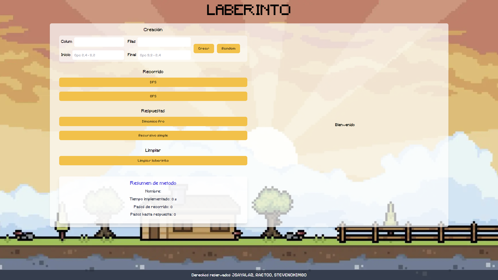
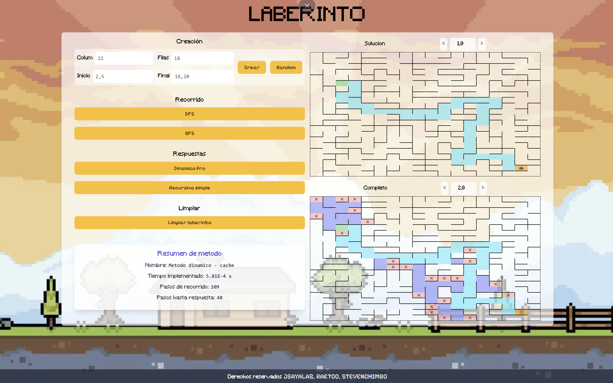

 
## Proyecto Laberinto

## Integrantes
- José Ayala
- Rafael Prieto
- Steven Chimbo

## Materia
Estructura de Datos

## Docente
Ing. Pablo Torres

## Informe del Proyecto Final: Algoritmo de Laberinto Aplicando Programación Dinámica y Estructura de Datos
Universidad Politécnica Salesiana

Integrantes de la Practica: José Ayala, Rafael Prieto y Steven Chimbo.
https://github.com/JSAYALAZ/LABERINTO-JAVA-REACT

## Correos institucionales
- ayalaz1@est.ups.edu.ec
- pprietos@est.ups.edu.ec
- schimboc@est.ups.edu.ec

## Descripción del Problema
El problema consiste en encontrar el camino más corto entre dos puntos, A que es el inicio y B el destino hacia dónde queremos llegar, en un laberinto definido como una matriz de celdas. Cada celda puede ser transitable o no transitable. Utilizaremos una combinación de algoritmos de búsqueda y una interfaz web para visualización.

## Propuesta de Solución
Implementaremos y compararemos cuatro algoritmos distintos para resolver el problema:
1. **Método Recursivo Simple**: Explora todos los caminos posibles desde el punto de inicio hasta el destino de manera recursiva. Es sencillo pero ineficiente para laberintos grandes debido a su alta complejidad temporal (exponencial).
2. **Método de Programación Dinámica**: Utiliza una tabla de memorización para almacenar resultados parciales y evitar cálculos redundantes. Más eficiente que el método recursivo simple, pero puede ser complicado de implementar.
3. **Búsqueda en Anchura (BFS)**: Explora los nodos del laberinto nivel por nivel, garantizando encontrar el camino más corto en un laberinto no ponderado. Eficiente en términos de tiempo y memoria, ideal para este tipo de problemas.
4. **Búsqueda en Profundidad (DFS)**: Explora los caminos posibles profundizando en cada camino antes de retroceder. No garantiza encontrar el camino más corto, pero útil para explorar todos los posibles caminos.

## Implementación
### Estructura del Proyecto
- Se utilizará Java para implementar la lógica de los algoritmos.
- La interfaz gráfica se implementará usando REACT - NEXT.JS para visualizar el laberinto y los caminos encontrados.

## Marco Teórico
### BFS (Breadth-First Search)
BFS es un algoritmo de búsqueda en grafos que explora todos los nodos a un mismo nivel antes de pasar al siguiente nivel. Es útil para encontrar el camino más corto en un laberinto o grafo no ponderado.

### DFS (Depth-First Search)
DFS es un algoritmo de búsqueda en grafos que explora lo más profundamente posible en una rama antes de retroceder. Aunque no garantiza encontrar el camino más corto, es útil para explorar todas las posibles rutas.

### Programación Dinámica
La programación dinámica es una técnica de optimización que se utiliza para resolver problemas complejos dividiéndolos en subproblemas más simples. Utiliza una tabla para almacenar los resultados de los subproblemas ya resueltos para evitar cálculos redundantes.
- **Definición**: Estrategia de optimización que soluciona cada subproblema una sola vez y guarda su resultado.
- **Aplicación en Laberintos**: Puede ser usada para calcular el camino más corto almacenando las distancias mínimas desde el punto inicial a cada celda.
- **Complejidad**: Depende del problema específico, pero suele mejorar significativamente el rendimiento comparado con métodos recursivos sin optimización.

### Métodos Recursivos
Los métodos recursivos implican que una función se llama a sí misma para resolver subproblemas. Aunque pueden ser intuitivos y fáciles de implementar, pueden ser ineficientes debido a la redundancia en los cálculos y la alta complejidad temporal.
- **Definición**: Técnica donde la solución de un problema depende de soluciones a instancias más pequeñas del mismo problema.
- **Aplicación en Laberintos**: Se puede usar para explorar todos los posibles caminos, pero puede ser ineficiente para laberintos grandes.
- **Complejidad**: Exponencial en el peor de los casos.

### Visualización en la Web
La visualización del laberinto en REACT. La interacción entre la lógica de los algoritmos implementados en Java y la visualización en la web es crucial para proporcionar una experiencia de usuario intuitiva.
- **React**: Lenguaje de marcado utilizado para estructurar el contenido de la web.

## Descripción de la Propuesta de Solución
- **Método Recursivo Simple**: Se explora cada posible movimiento desde la posición actual hasta encontrar el destino. Se implementa una función recursiva que intenta mover en todas las direcciones (arriba, abajo, izquierda, derecha).
- **Método Aplicando Caché (Programación Dinámica)**: Similar al método recursivo, pero utilizando una tabla para almacenar las soluciones de subproblemas ya resueltos. Esto evita cálculos redundantes y mejora la eficiencia.
- **BFS (Breadth-First Search)**: Utiliza una cola para explorar cada nivel del laberinto. Marca las celdas visitadas para evitar ciclos y caminos redundantes.
- **DFS (Depth-First Search)**: Utiliza una pila para explorar profundamente en una dirección antes de retroceder. También marca las celdas visitadas para evitar ciclos.

## Herramientas y/o Lenguajes Utilizados
- **Tecnologias**: Java, React, Nodejs
- **Herramientas**: Spring-boot, Nextjs

## Criterio por Integrante de la Propuesta
Cada integrante del equipo evaluará los siguientes criterios:
- **José Ayala**: Eficiencia del Algoritmo en cuanto al tiempo de ejecución y uso de memoria.
- **Steven Chimbo**: Claridad del Código en cuanto facilidad de lectura y mantenimiento.
- **Rafael Prieto**: Correctitud del Algoritmo en cuanto a la Verificación de que el algoritmo encuentra el camino correcto.

## Capturas de la Implementación Final de la UI

## Conclusiones
### Comparación de Métodos
- **Recursiva (DFS)**
  - Pros: Fácil de implementar, buena para encontrar cualquier camino.
  - Contras: Puede ser ineficiente en términos de tiempo y espacio para laberintos grandes debido a la profundidad de la recursión.

- **Búsqueda en Anchura (BFS)**
  - Pros: Garantiza encontrar el camino más corto en un grafo no ponderado.
  - Contras: Puede consumir más memoria debido a la necesidad de almacenar todos los nodos en el nivel actual.

- **Programación Dinámica**
  - Pros: Optimiza el tiempo de ejecución al almacenar los resultados de subproblemas ya resueltos.
  - Contras: La implementación puede ser más compleja y requiere memoria adicional para almacenar los resultados.

### Mejor Opción
La mejor opción para encontrar el camino más corto en un laberinto es la Búsqueda en Anchura (BFS). Esto se debe a que BFS explora todos los caminos posibles nivel por nivel, garantizando así el camino más corto en un grafo no ponderado. Aunque puede consumir más memoria, su capacidad para encontrar la solución óptima de manera consistente la hace superior a otros métodos en términos de encontrar el camino más corto.

### Consideraciones
#### Posibles Mejoras
- Implementación del algoritmo A* para considerar laberintos con pesos en las celdas.
- Optimización de la memoria utilizando estructuras de datos más eficientes.
- Extensión a laberintos tridimensionales.

Cada estudiante podría enfocarse en:
- **Steven Chimbo**: Investigación y documentación de algoritmos de búsqueda.
- **José Ayala**: Desarrollo de la interfaz de usuario y visualización de rutas.
- **Rafael Prieto**: Pruebas y validación de los algoritmos implementados.